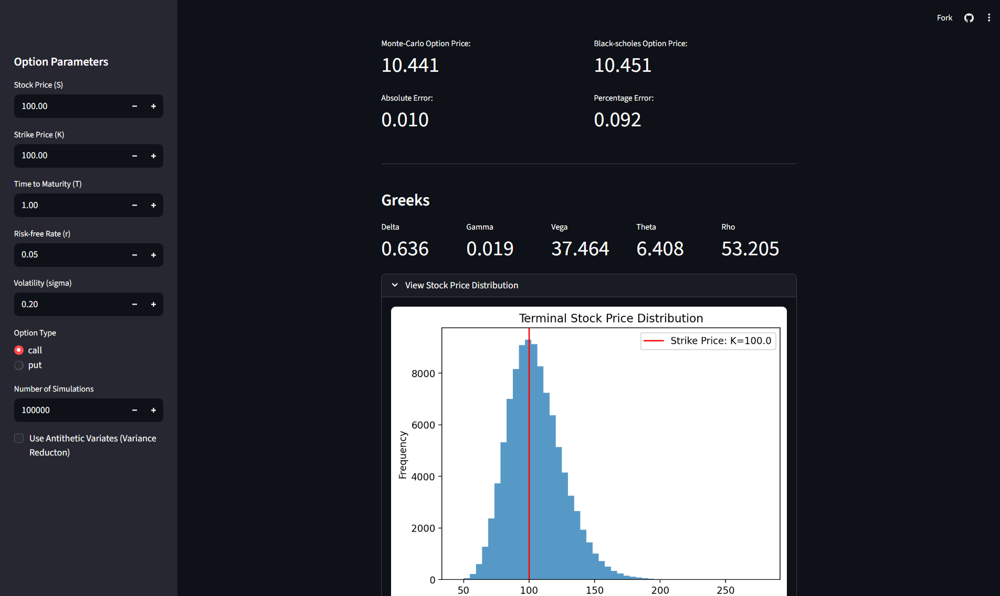
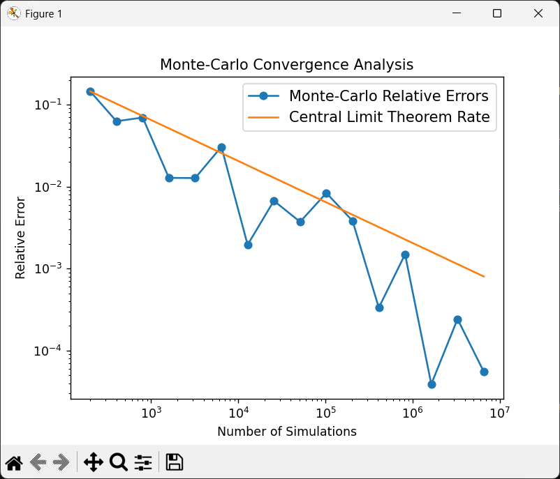
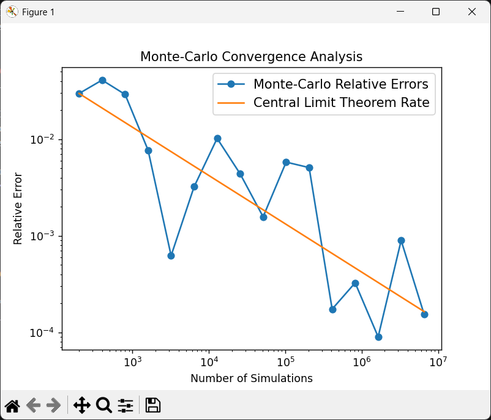
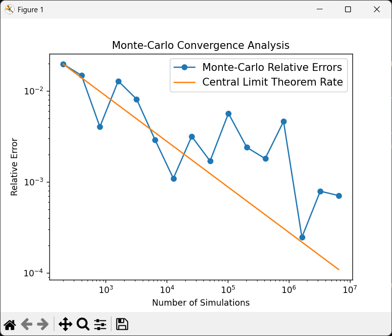
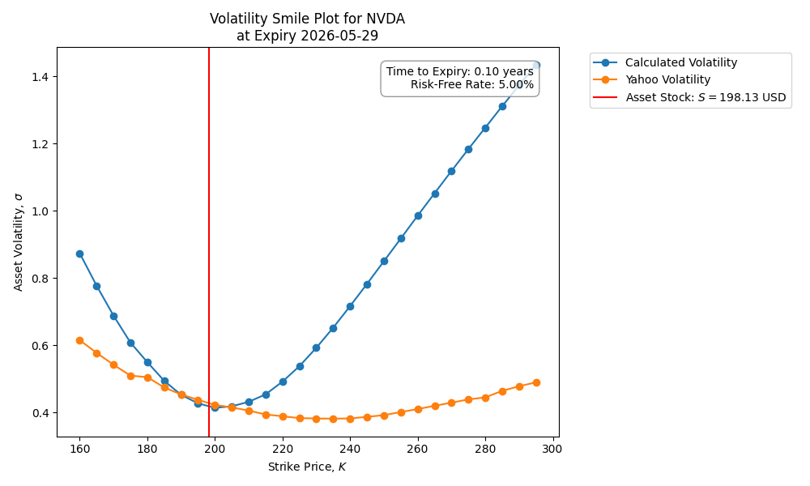
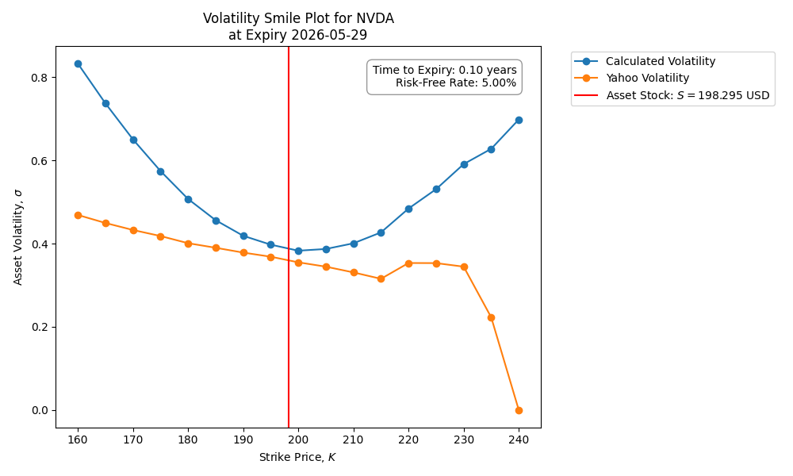

# 📈 Monte-Carlo Option Pricer & Risk Analyser

> ✨ **Live Demo:** [Click here to try the new interactive dashboard!](https://monte-carlo-options-pricing-76douzrylgmmpgxymv4oem.streamlit.app/) \
>   *Price European call & put options, Calculate Greeks & View Price Distributions with user-friendly inputs*

## 🔍 Overview

Monte-carlo simulator using Brownian motion to simulate stochastic asset price behaviour and price European option pay-offs.

## 🗒️ Features
- **:game_die: Monte-Carlo Simulation:** Runs multiple Monte-Carlo simulations of asset prices in parallel to estimate European option pay-off.
- **:microscope: Black-Scholes Validation:** Calculates analytic Black-Scholes solution to compare with Monte-Carlo simulation.
- **:level_slider: Multiple Parameters:** Asset price, strike price, time to maturity, risk-free rate, asset volatility and option type (call or put) can all be changed while subject to robust input validation.
- **:chart_with_downwards_trend: Convergence Analysis:** Plots relative error sizes against number of simulations to study convergence rates.
- **:bar_chart: Interactive Dashboard:** Live web app with dynamic parameter inputs and histogram of asset prices at maturity.
- **:jigsaw: Volatility Calibration:** Estimating the volatility of real-world asset using the bid and ask prices of European options accessible through Yahoo Finance API.

<div align="center" style="padding-top: 50px;">
    
    <p><i>[Screenshot of the interactive Streamlit dashboard's features.]</i></p>
</div>


## :books: Mathematical Theory
- **Stochastic Calculus:**  Closed-form solution of Geometric Brownian Motion (GBM) to simulate asset price behaviour.
- **Finite-Difference Numerical Methods:** Central First-Order & Second-Order Approximations with Common Random Numbers (CRMs) to calculate Greeks with reduced noise.
- **Bisection Method:** Stable, robust non-linear equation solver to calculate volatility of an asset using real-world European option parameters.
- **Variance Reduction:** Option to include antithetic variates when generating random seed to reduce the variance of the random samples.

## :exclamation: Key Results

Monte-Carlo price approaches Black-Scholes price as simulation count increases. At 100,000 simulations, the error is almost guranteed to be less than 1%.

|        Pathway Count         |  Mean of Monte Carlo Prices  |     Black Scholes Price      |        Absolute Error        |       Percentage Error       |
|:----------------------------:|:----------------------------:|:----------------------------:|:----------------------------:|:----------------------------:|
|             1000             |            11.65             |            10.45             |             1.20             |            11.52             |
|             2000             |            10.51             |            10.45             |             0.06             |             0.55             |
|             4000             |            10.29             |            10.45             |             0.16             |             1.51             |
|             8000             |            10.35             |            10.45             |             0.10             |             0.92             |
|            16000             |            10.56             |            10.45             |             0.11             |             1.02             |
|            32000             |            10.39             |            10.45             |             0.06             |             0.62             |
|            64000             |            10.41             |            10.45             |             0.04             |             0.36             |
|            128000            |            10.46             |            10.45             |             0.01             |             0.11             |

*(Asset price = 100, Strike price = 100, Time to Maturity = 1, Risk-free Rate = 0.05, Asset Volatility = 0.2, Option Type = "Call")*

## :chart_with_downwards_trend: Convergence Analysis

I created a log-log plot of pathway counts against relative error. The theoretical rate assumes that $\text{relative error} \propto \frac{1}{\sqrt{\text{pathway count}}}$ like the central limit theorem suggests. Hence, the slope of the theoretical line is -0.5. As seen in the figures below, due to random noise from the Monte-Carlo simulation, the convergence rate can be faster or slower than the theoretical rate as shown below:

<p>
    
    
    
</p>

*(Asset price = 100, Strike price = 100, Time to Maturity = 1, Risk-free Rate = 0.05, Asset Volatility = 0.2, Option Type = "Call")*

## :slightly_smiling_face: Volatility Smile

I calculated the volatility of assets such as NVDA and AAPL by using option ticker data from Yahoo Finance. I began by approximating the option price by taking the average of the bid and ask prices, then used the bisection method to approximate the volatility (sigma). I had to clean the data by excluding options with strikes that were too far in or out of the money, as well as options that violated arbitrage laws. The resulting volatility-strike plot was unmistakably a volatility smile. However, the implied volatility values that were provided by Yahoo Finance were often very different from the calculated values, especially for in or out of the money options.
<p>
    
    
</p>

*[Figure on left: volatility smile for European call option. Figure on right: volatility smile for European put option.]*

*(Note: Figures were collected at 16:00 BST on 2026-04-20.)*

## :bulb: Lessons Learned

- It is imperative to know the formulas you are working with; I was stuck at a 4.8% percentage error for a while because I forgot to discount a factor of $e^{-rT}$ when calculating the option payoff from the terminating asset price.
- Cleaning and sanitising data that is collected from APIs is crucial; I spent a lot of time debugging my bisection method-solver when the real underlying issue was that it was receiving extreme option data that violated arbitrage rules.

## :file_folder: Repository Structure

```
└── 📁monte-carlo-project
    └── 📁results
        ├── convergence_plot_01.png
        ├── convergence_plot_02.png
        ├── convergence_plot_03.png
        ├── smile_call_20260420.png
        ├── smile_put_20260420.png
        ├── volatility_plot.png
    └── 📁scripts
        ├── test_convergence.py
        ├── test_validation.py
        ├── volatility_smile.py
    └── 📁src
        ├── __init__.py
        ├── black_scholes.py
        ├── calibration.py
        ├── data_models.py
        ├── greeks.py
        ├── monte_carlo.py
        ├── plot_convergence.py
        ├── tabulate.py
    └── 📁tests
        ├── test_calibration.py
        ├── test_greeks.py
        ├── test_option_price.py
    ├── .gitignore
    ├── app.py
    ├── LICENSE
    ├── README.md
    ├── requirements.txt
    └── TODO.md
```


## :wrench: Usage
```bash
## Installation
git clone https://github.com/JibrilAbdi144/monte-carlo-project.git
cd monte-carlo-project

## Run convergence table & convergence plot scripts
python scripts/test_convergence.py

## Run volatility smile script
python scripts/volatility_smile.py
```

## :test_tube: Testing
This project uses `pytest` for unit testing.
Run tests using:
```bash
pytest
```
*(Note: Some tests may show a fail due to Monte-Carlo simulation noise, repeat test if it appears.)*

## :hourglass: Future Exploration
- Test whether the model $\text{Relative Error} \propto \frac{1}{\sqrt{\text{Pathway Count}}}$ really is true or just an assumption. Analyse the distribution of plot gradients that repeated iterations provide, then use the Strong Law of Large Numbers (SLLN) to verify that the gradients average around -0.5.
- More in-depth of analysis of antithetic variates and other variance reduction techniques, convergence analysis of the convergence speed, and comparing advantages and disadvantage of different methods.
- Further research into why my calculated values for volatility in the volatility smile plot is different from the implied volatility values provided by Yahoo Finance, perhaps they are calculating asset volatility through a different means?

